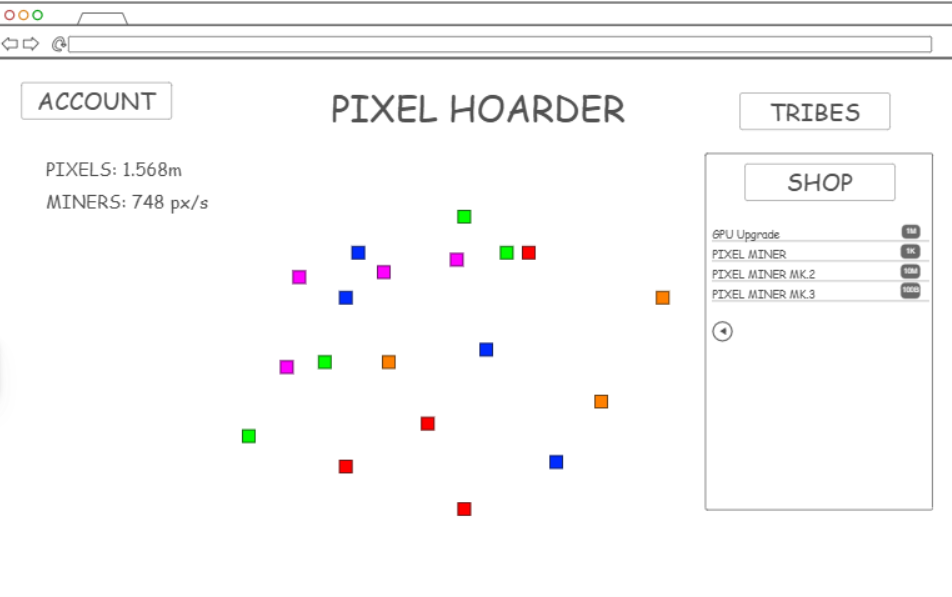

# Pixel Hoarder

[My Notes](notes.md)

Pixel Hoarder will be a simple web idle game that can be played be users. Players have to collect pixels that periodically appear on the screen, and get ways to automate their pixel gathering.

## 🚀 Specification Deliverable

For this deliverable I did the following. I checked the box `[x]` and added a description for things I completed.

- [x] Proper use of Markdown
- [x] A concise and compelling elevator pitch
- [x] Description of key features
- [x] Description of how you will use each technology
- [x] One or more rough sketches of your application. Images must be embedded in this file using Markdown image references.

### Elevator pitch

Pixel Hoarder is an epic web idle game! The game keeps track of users and progress that they have made, which they can make by gathering pixels! Gathering more pixels allows them to upgrade their graphics card, allowing for more and more pixels to appear, and eventually tools to help them become the Lord of Pixels! 

### Design

### Key features

- Secure login over HTTPS
- Interactive UI for clicking pixels
- Progression system through shop
- Friend system through tribes
- Saved game progress through database storage
- Offline progress through time stamping

### Technologies

I am going to use the required technologies in the following ways.

- **HTML** - Makes the structure of the application. Two web pages, one for logging in and one for gameplay.
- **CSS** - Stylization for UI and gameplay.
- **React** - Interactive UI elements, such as clicking on pixels, and also provides login and tribe display.
- **Service** - Backend service which includes the following endpoints:
    - Login
    - Pixel Clicking
    - Upgrade Purchase
    - Tribe Friend Requests
    - Tribe Pixel Gifting
    - Offline Progress Rewards
- **DB/Login** - Stores user data (including usernames, encrypted passwords, etc), authentication tokens for signed in users, and game data of the user (including time stamps, pixel amounts, and purchased upgrades)
- **WebSocket** - When friends within tribes reach certain milestones, notifications are sent to other members of the tribe. Additionally, when giving/receiving gifts from other players, involved members receive notifications.

## 🚀 AWS deliverable

For this deliverable I did the following. I checked the box `[x]` and added a description for things I completed.

- [x] **Server deployed and accessible with custom domain name** - [My server link](https://pixelhoarder.click).

## 🚀 HTML deliverable

For this deliverable I did the following. I checked the box `[x]` and added a description for things I completed.

- [x] **HTML pages** - I made HTML bases for Login, Register, Game, and Social pages.
- [x] **Proper HTML element usage** - I used proper HTML element usage (as far as I'm aware hopefully).
- [x] **Links** - I included links to navigate to other pages as well as to the Github repository.
- [x] **Text** - I used several instances of text being displayed to the pages.
- [x] **3rd party API placeholder** - I included a place for a random quote generator during the game, although I might change this idea when we come to it later.
- [x] **Images** - I included the main title of the game as an image.
- [x] **Login placeholder** - I made a login placeholder page and form, as well as one for registration.
- [x] **DB data placeholder** - I include buttons for login and registration that can update the database with user information, as well as include references to the player's pixel count, which would also be stored there.
- [x] **WebSocket placeholder** - I included a Social Page which currently is set up to show the top high-scores of players and update realtime, but the social page could also potentially include other things.

## 🚀 CSS deliverable

For this deliverable I did the following. I checked the box `[x]` and added a description for things I completed.

- [ ] **Visually appealing colors and layout. No overflowing elements.** - I did not complete this part of the deliverable.
- [ ] **Use of a CSS framework** - I did not complete this part of the deliverable.
- [ ] **All visual elements styled using CSS** - I did not complete this part of the deliverable.
- [ ] **Responsive to window resizing using flexbox and/or grid display** - I did not complete this part of the deliverable.
- [ ] **Use of a imported font** - I did not complete this part of the deliverable.
- [ ] **Use of different types of selectors including element, class, ID, and pseudo selectors** - I did not complete this part of the deliverable.

## 🚀 React part 1: Routing deliverable

For this deliverable I did the following. I checked the box `[x]` and added a description for things I completed.

- [ ] **Bundled using Vite** - I did not complete this part of the deliverable.
- [ ] **Components** - I did not complete this part of the deliverable.
- [ ] **Router** - I did not complete this part of the deliverable.

## 🚀 React part 2: Reactivity deliverable

For this deliverable I did the following. I checked the box `[x]` and added a description for things I completed.

- [ ] **All functionality implemented or mocked out** - I did not complete this part of the deliverable.
- [ ] **Hooks** - I did not complete this part of the deliverable.

## 🚀 Service deliverable

For this deliverable I did the following. I checked the box `[x]` and added a description for things I completed.

- [ ] **Node.js/Express HTTP service** - I did not complete this part of the deliverable.
- [ ] **Static middleware for frontend** - I did not complete this part of the deliverable.
- [ ] **Calls to third party endpoints** - I did not complete this part of the deliverable.
- [ ] **Backend service endpoints** - I did not complete this part of the deliverable.
- [ ] **Frontend calls service endpoints** - I did not complete this part of the deliverable.
- [ ] **Supports registration, login, logout, and restricted endpoint** - I did not complete this part of the deliverable.

## 🚀 DB deliverable

For this deliverable I did the following. I checked the box `[x]` and added a description for things I completed.

- [ ] **Stores data in MongoDB** - I did not complete this part of the deliverable.
- [ ] **Stores credentials in MongoDB** - I did not complete this part of the deliverable.

## 🚀 WebSocket deliverable

For this deliverable I did the following. I checked the box `[x]` and added a description for things I completed.

- [ ] **Backend listens for WebSocket connection** - I did not complete this part of the deliverable.
- [ ] **Frontend makes WebSocket connection** - I did not complete this part of the deliverable.
- [ ] **Data sent over WebSocket connection** - I did not complete this part of the deliverable.
- [ ] **WebSocket data displayed** - I did not complete this part of the deliverable.
- [ ] **Application is fully functional** - I did not complete this part of the deliverable.
